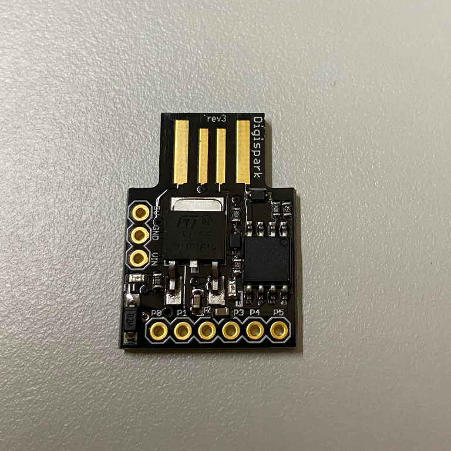

# Digispark Software Examples

I have a Digispark USB development board (CPU: ATtiny85, 8-bit AVR, 0-10 MHz
@2.7-5.5V, 0-20 MHz @4.5-5.5V) that I brought from Gearbest for a unit price
of $3.33 USD. Note that the sales price for a Digispark at the official site
is $7.85 USD.



As can be seen from the picture, it shows "rev3" on the board. [According to
Digistump](https://digistump.com/wiki/digispark/tutorials/modelbi2c), this is
likely a counterfeit that functionally matches the authentic Digispark
revisions 2 and 4. Note that in this configuration, the on-board LED is on
Pin 1 (NOT Pin 0).

## Setup

Follow the instructions on Digistump's tutorial [Connecting and Programming Your Digispark](https://digistump.com/wiki/digispark/tutorials/connecting) to set up the development environment. My tested setup is as follows

- Ubuntu 18.04.5 LTS (x86_64)
- Arduino 1.8.10
- Digistump board manager URL:
`http://digistump.com/package_digistump_index.json`
- Manual installation of `libusb`

    ```bash
    sudo apt install libusb-1.0-0-dev libusb-0.1-4
    ```

- Manual installation of the following `udev` rule at
/etc/udev/rules.d/49-micronucleus.rules

    ```text
    # UDEV Rules for Micronucleus boards including the Digispark.
    # This file must be placed at:
    #
    # /etc/udev/rules.d/49-micronucleus.rules    (preferred location)
    #   or
    # /lib/udev/rules.d/49-micronucleus.rules    (req'd on some broken systems)
    #
    # After this file is copied, physically unplug and reconnect the board.
    #
    SUBSYSTEMS=="usb", ATTRS{idVendor}=="16d0", ATTRS{idProduct}=="0753", MODE:="0666"
    KERNEL=="ttyACM*", ATTRS{idVendor}=="16d0", ATTRS{idProduct}=="0753", MODE:="0666", ENV{ID_MM_DEVICE_IGNORE}="1"
    #
    # If you share your linux system with other users, or just don't like the
    # idea of write permission for everybody, you can replace MODE:="0666" with
    # OWNER:="yourusername" to create the device owned by you, or with
    # GROUP:="somegroupname" and mange access using standard unix groups.
    ```

Note that one needs to invoke "upload" before plugging in the Digispark board for programming.

## Code

Software can be found in the [src](./src) directory.
